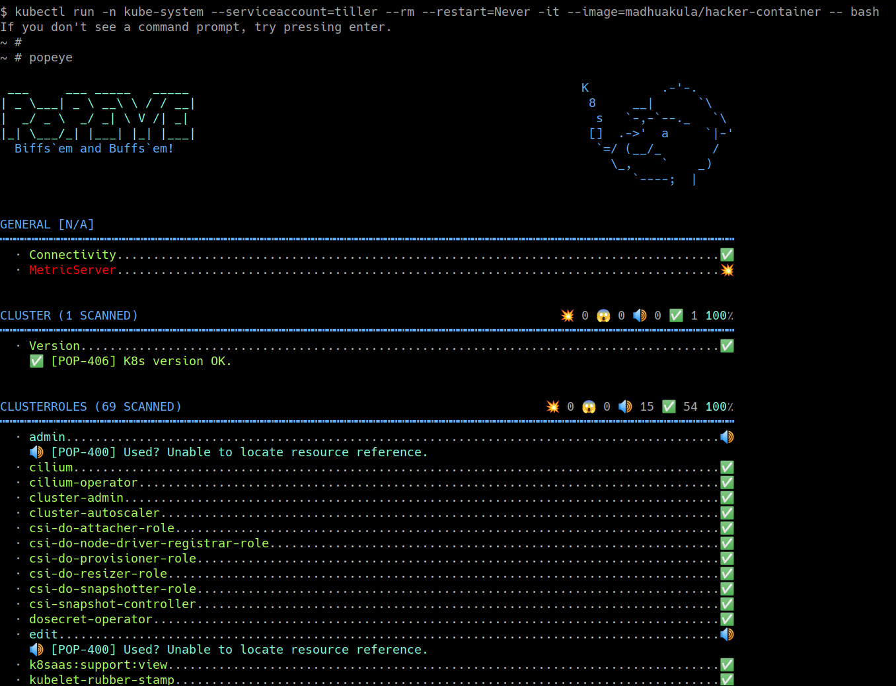

# Popeye - A Kubernetes Cluster Sanitizer

## Scenario Information

This scenario is mainly to perform the review of Kubernetes Cluster by scanning the live Kubernetes cluster and reports potential issues with deployed resources and configurations.

* To get started with this scenario you can run the following command to start the hacker-container with cluster administrator privileges (as tiller service account already has that)

```bash
kubectl run -n kube-system --serviceaccount=tiller --rm --restart=Never -it --image=madhuakula/hacker-container -- bash
```

## Scenario Solution

`Popeye` is a utility that scans live Kubernetes cluster and reports potential issues with deployed resources and configurations. It sanitizes your cluster based on what's deployed and not what's sitting on disk. By scanning your cluster, it detects misconfigurations and helps you to ensure that best practices are in place, thus preventing future headaches.

Here is a list of some of the available sanitizers:

* Node
* Namespace
* Pod
* Service
* ServiceAccount
* Secrets
* ConfigMap
* Deployment
* StatefulSet
* DaemonSet
* PersistentVolume
* PersistentVolumeClaim
* HorizontalPodAutoscaler
* PodDisruptionBudget
* ClusterRole
* ClusterRoleBinding
* Role
* RoleBinding
* Ingress
* NetworkPolicy
* PodSecurityPolicy

> Refer to [https://github.com/derailed/popeye](https://github.com/derailed/popeye) for more details about the project

* Run the `popeye` in cluster by using cluster token privileges

```bash
popeye
```



## Miscellaneous

* [https://github.com/derailed/popeye](https://github.com/derailed/popeye)
